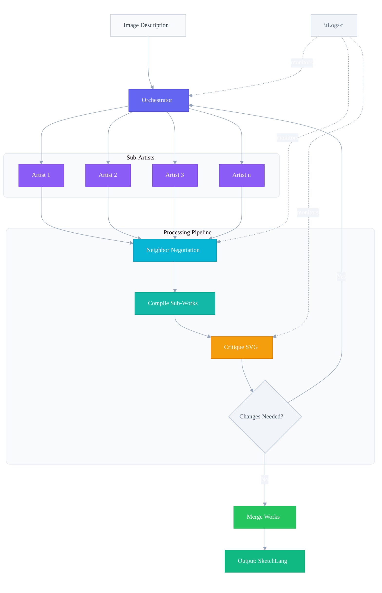

## Sketch Studio

### Overview

This project implements a studio in GoLang where an input image description is processed by an LLM (artist) to iteratively produce a final sketch in SketchLang. The process involves planning, dividing into sections, critiquing, compiling, and merging sub-works with transparency via logging.

### Components

**Artist**: Plans steps, divides work into tiles/sections recursively, delegates details, ensures coherency via negotiation.
**Critic**: Reviews specific sections, provides feedback (sections may align with artist's named divisions).
**Compilation**: Verifies sub-pieces align; checks SketchLang compilation errors before merging.
**Merging**: Negotiates changes between neighboring sub-artists; compiles sub-works first to avoid upstream issues.
**Transparency**: Logs top-level plans, draft SVGs, critic responses, compilation errors, token usage (if available), and step timings.
Prompt Design: Key prompts for top-level artist (detailed description + tiling) and sub-artists; easily accessible.

### Program Flow

